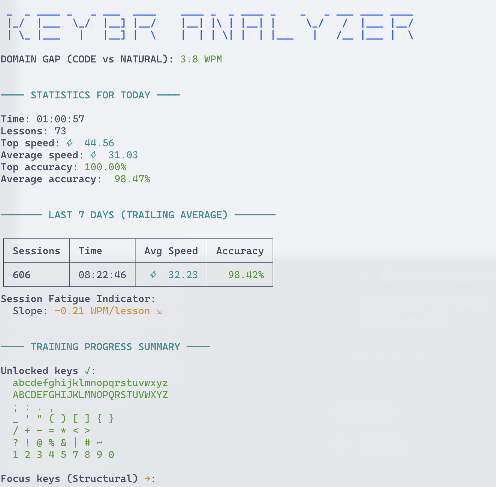
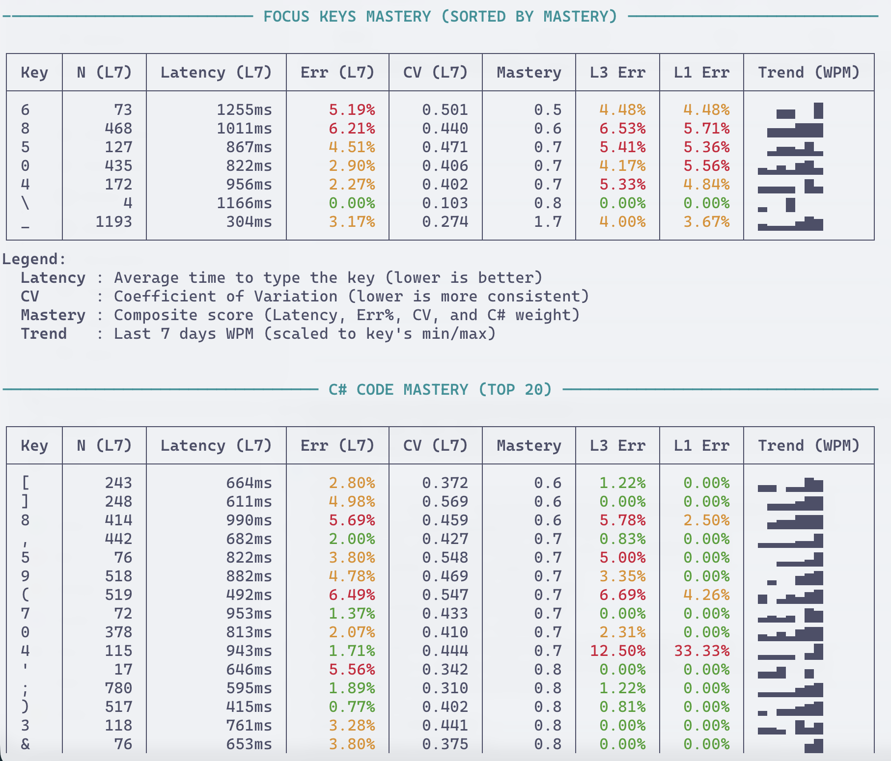
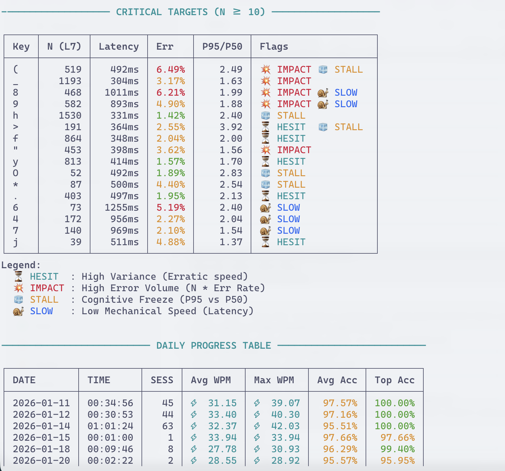

# KeybrAnalyzer

A .NET console application that analyzes typing data exported from [Keybr.com](https://www.keybr.com/). It provides detailed insights into your typing performance, including speed (WPM), accuracy, and key-specific latency across different time periods, with a special focus on C# programming.



## Features

- **Automatic Data Discovery**: Automatically finds the latest `typing-data*.json` file in your `~/Downloads` folder or a custom path.
- **Comprehensive Reporting**:
  - **General Stats**: Overview of all-time, last 7 days, and today's performance.
  - **Domain Gap Analysis**: Measures the performance difference between "code" and "natural" text types.
  - **Training Progress**: Summary of unlocked, focus, and locked keys.
  - **Advanced Key Analysis**:
    - **Mastery Score**: A composite metric (Latency, Err%, Consistency, and C# weight).
    - **Consistency (CV)**: Coefficient of Variation to measure typing rhythm.
    - **Cognitive Stalls**: Identification of cognitive freezes by comparing P95 and P50 latencies.
    - **Critical Targets**: Identification of keys needing focus based on hesitation, impact, stalls, or low speed.
  - **Daily Progress**: Historical view of your typing sessions with visual sparklines.
  - **Accuracy Streaks**: Tracking consecutive lessons above 100%, 97%, and 95% accuracy.
  - **Fatigue Monitoring**:
    - **Session Fatigue Analysis**: Performance trends across lesson blocks.
    - **Real-time Indicator**: Slope analysis of current session performance to detect diminishing returns.
  - **Visual Keyboard Layouts**: Visual progress maps by finger, key type, or status (Unlocked/Locked).
  - **Visual Feedback**: Uses ANSI colors and sparklines for rich terminal output.






## Prerequisites

- [.NET 10.0 SDK](https://dotnet.microsoft.com/download/dotnet/10.0)

## Getting Started

1. **Export your data**: Go to [Keybr.com Settings](https://www.keybr.com/settings) and click on "Export Data" to download your `typing-data.json`.
2. **Run the analyzer**:
   ```bash
   dotnet run --project src/KeybrAnalyzer/KeybrAnalyzer.csproj
   ```

## Installation

To install the analyzer as a standalone tool:

1. **Publish the application**:
   ```bash
   dotnet publish -c Release -r osx-arm64 --self-contained
   ```
   *(Note: Change `osx-arm64` to your specific platform if necessary, e.g., `osx-x64` or `linux-x64`.)*

2. **Copy the binary to your local bin**:
   ```bash
   cp src/KeybrAnalyzer/bin/Release/net10.0/osx-arm64/publish/analyzekeybr ~/.local/bin/analyzekeybr
   ```

3. **Update your PATH**:
   Ensure `~/.local/bin` is in your `PATH` by adding this to your `.zshrc` or `.bashrc`:
   ```bash
   export PATH="$HOME/.local/bin:$PATH"
   ```

4. **Usage**:
   Now you can run the analyzer from any directory:
   ```bash
   analyzekeybr
   ```

## Configuration

You can configure the analyzer via `appsettings.json` or environment variables:

- `KeybrAnalyzer:DataFilePath`: Direct path to a specific typing-data.json file.
- `KeybrAnalyzer:SourceDirectory`: Directory to search for typing-data*.json files.
- `KeybrAnalyzer:ShowAllStats`: Set to `true` to enable verbose reporting (detailed layout maps, etc.).
- `KeybrAnalyzer:OpenedKeys`: List of keys currently unlocked in your training.
- `KeybrAnalyzer:FocusKeys`: List of keys you are currently focusing on.
- `KeybrAnalyzer:LockedKeys`: Dictionary of keys grouped by tier that are still locked.

## Development

### Building the project

```bash
dotnet build
```

### Running tests

```bash
dotnet test
```

### Code Formatting

The project uses StyleCop and other analyzers to enforce code quality. To format the code according to the project's standards:

```bash
dotnet format KeybrAnalyzer.slnx
```
